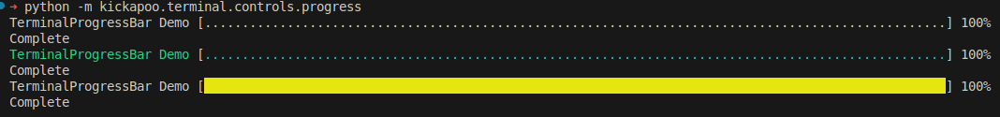

# kickapoo-terminal

Scrpting and age caught up wiht me and all white terminals were a bit much on my eyes. I also write a lot of scripts and prefer to have controls and color to give me some visual awareness of what my script is doing.

I've used Open Source and apprecaite it! While this may not be much, it is a contribution that I hope others find helpful.

## Why kickapoo-*

It is quite possible that I have some kickapoo blood in me. I'm aot an oficial registerd a member, but tracing back my roots leads me to Eagle Pass, near the Mexico Kickapoo reservation. 

## Installation

```bash
pip install "https://github.com/hm34306/kickapoo-terminal.git@0.2.3"
```

In pyproject.toml:
```toml
dependencies = [
  "kickapoo-terminal @ git+https://github.com/hm34306/kickapoo-terminal.git@0.2.3",
]
```

## Demo

A demo canm be ran if the source is pulled. The demo uses TerminalStoreTeller and runs a few code examples.

```bash
cd src
./demo.py
```

## Controls

### Waiter

A naive progress bar that moves forward.

### Spinner

A naiver spinner that works off of a list.

### Progress Bar

Similar to waiter, howefver is percentage based.

### Common Attributes

Each class has common attributes that allow you to decorate the control as you see fit. While the defaults are opinionated, you have contorl to make it your own!

### Example

```python
prefix="[", suffix="]", frames=2, message_color=FontColor.Cyan, symbol_color=FontColor.Green, symbol=".
```

A note about the frames attribute: frames give you control on how often you want to refresh on the terminal. Depending on your application af fra e of 2 may be waht you need. If you look at the demo, you see i have frames set to 10000 becasue thre is no contention for resources. 

## Colors

Colors has srtatic classes for 

- FontColor
- BackgroundColor
- FontFormat


## Examples
Each of the modules can be executed and you will get a quick demo.

```bash
python -m kickapoo.terminal.controls.progress
python -m kickapoo.terminal.controls.spinner
python -m kickapoo.terminal.controls.waiter
```

### TerminalProgressBar

```python
t_spinner = TerminalProgressBar(
    frames=10000, 
    message_color=FontColor.GREEN, 
    symbol_color=FontColor.CYAN)
counter = 1
for i in range(1000000):
    t_spinner.render("TerminalProgressBar Demo", counter, total)
    counter += 1
t_spinner.exit()
print("Complete")
```

### TerminalSpinner

```python
t_symbol = TerminalSpinner(
    frames=10000, 
    message_color=FontColor.GREEN, 
    symbol_color=FontColor.CYAN)
for i in range(1000000):
    t_symbol.render("TerminalSpinner BASIC & Color Demo")
t_symbol.exit()
print("Complete")
```

### TerminalSymbolWaiter

```python
t_spinner = TerminalSymbolWaiter(
    frames=10000, 
    message_color=FontColor.GREEN, 
    symbol_color=FontColor.CYAN)
for i in range(1000000):
    t_spinner.render("TerminalSymbolWaiter [Green and Cyan Text] Demo")
t_spinner.exit()
print("Complete")
```


### TerminalProgressBar Demo

